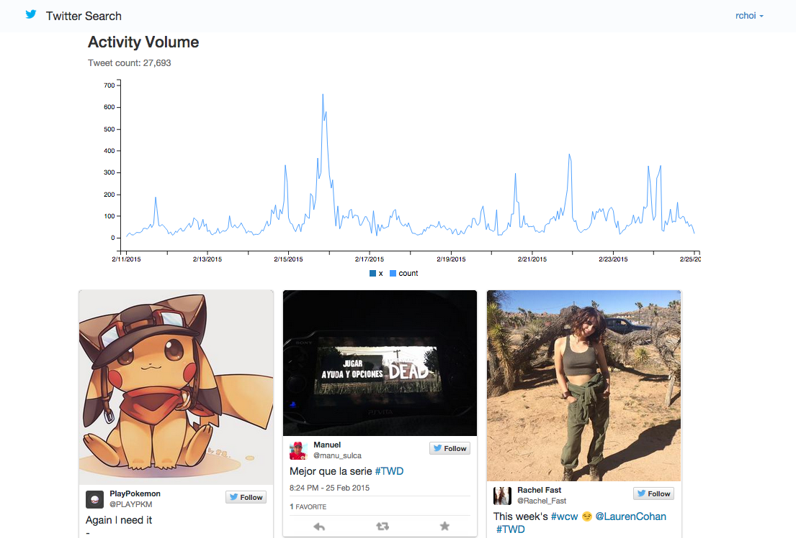
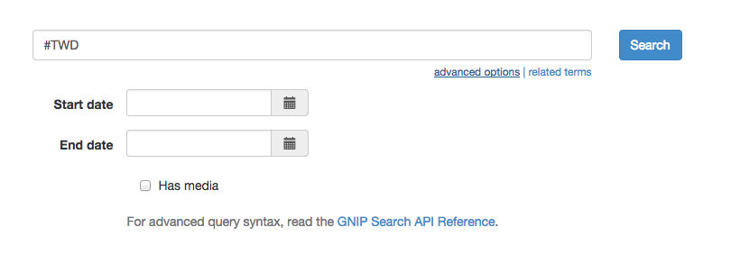

Audience Creation and Ad Targeting using Twitter Data (Gnip) and Ads API
=================

Targeting writes use a CSRF-protected browser POST and one OAuth 1.0a provider
POST to `https://ads-api.x.com/12`. The provider request is UTF-8 form encoded,
does not follow redirects or retry, has bounded timeouts, and accepts at most
64 KiB of JSON response data. After a timeout or connection failure, inspect
the Ads account before retrying because the outcome is unknown and the API does
not expose an idempotency key for this operation.

Security maintenance
====================

The browser runtime uses the official Bootstrap 3.4.1 JavaScript release that
patched CVE-2019-8331 and official jQuery 3.7.1. Their vendored files are pinned
by SHA-256 in the offline integration contract. The unused readable Bootstrap
3.0.3 copy and jQuery 1.10.1 runtime were removed.
The app's window-load handler and legacy date-time picker shim were updated to
avoid jQuery APIs removed in jQuery 3.

The legacy GNIP client no longer accepts an arbitrary output directory or
writes paged responses to caller-selected filesystem paths. Current application
callers consume results in memory.

Upstream release evidence:

- https://blog.getbootstrap.com/2019/02/13/bootstrap-4-3-1-and-3-4-1/
- https://blog.jquery.com/2023/08/28/jquery-3-7-1-released-reliable-table-row-dimensions/

This sample uses GNIP full archive search to iteratively create audiences for ad targeting on Twitter. It uses the Full Archive Search API to determine volume of tweets about a topic, uploads them
as an audience via the TON API, and then allows creation of new Campaigns against that audience.

As always, when developing on top of the Twitter platform, you must abide by the [Developer Agreement & Policy](https://dev.twitter.com/overview/terms/agreement-and-policy).

Requirements
============

To run this sample code, you can install the required libraries with:

	`pip install -r requirements.txt`

Also note that your Twitter App needs to have Twitter Ads API access. Learn more about getting access here:

https://dev.twitter.com/ads/overview

Getting Started
============

- Create a Twitter App (https://apps.twitter.com/). Also, ensure that the Callback URL is populated. This can point to http://localhost:9000 to start. If it is not included, you will get Client Authorization errors upon login.

- Configure credentials only through local environment variables. Never place
  real values in tracked Python settings files:

    `CONSUMER_KEY`, `CONSUMER_SECRET`, `ACCESS_TOKEN`,
    `ACCESS_TOKEN_SECRET`, `GNIP_USERNAME`, `GNIP_PASSWORD`, and
    `GNIP_SEARCH_ENDPOINT`.

- To initialize your database, run the from the `tweet-search` directory:

  `python manage.py migrate --settings=app.settings`

- To start the server, run the following from the `tweet-search` directory:

  `fab start`

- Open a browser and go to http://localhost:9000

Note that the GNIP_SEARCH_ENDPOINT is a URL to the full archive search URL, and is in the format `https://data-api.twitter.com/search/fullarchive/...`.
If you want to use the 30-day search, open the `gnip_search_api.py` file, search for the term "30 DAY" and follow the instructions. (You also need to
use the 30-day search URL, and not the full arhive search URL.)

Sample Queries
============

Some sample queries to run:

- Hashtag search (default AND): `#MLB #SFGiants`
- Mention search, no retweets: `@TwitterDev -(is:retweet)`
- Search with images/videos: `walking dead (has:media)`

Advanced Options
============

In the UI, there is a link to show advanced options. Specifically:

- Start/end dates. GNIP search allows a variable timeframe to search. For optimal results, 30 days will return a response in a reasonable timeframe.
- Has media. This appends `(has:media)` to your query

